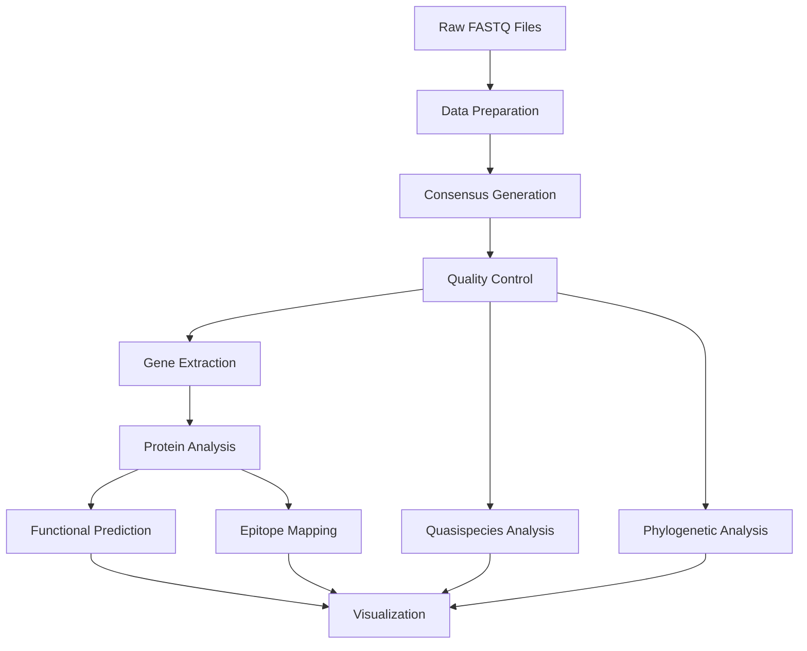

# HBV Mother-to-Child Transmission Analysis Pipeline

## Project Overview

This repository contains the complete bioinformatics pipeline for analyzing Hepatitis B virus (HBV) mother-to-child transmission using Oxford Nanopore long-read sequencing data. The study characterizes 749 mutations across 16 clinical samples (8 mother-infant pairs) infected with HBV genotypes C and D.

### Key Findings
- **749 mutations analyzed** across all four major HBV proteins
- **82.4% deleterious rate** indicating extreme functional constraints
- **Novel L256P drug resistance mutation** discovered
- **Vaccine escape mutations** L140F and P145L identified
- **96% epitope disruption rate** in surface antigen
- **Complete transmission bottleneck analysis** performed

---

## Table of Contents

- [Installation](#️-installation)
- [Project Structure](#-project-structure)
- [Pipeline Workflow](#-pipeline-workflow)
- [Usage](#-usage)
- [Results](#-results)
- [Citation](#-citation)
- [Contributing](#-contributing)
- [License](#-license)

---

## Installation

### Prerequisites
```bash
# System requirements
- Linux/macOS (tested on Ubuntu 20.04)
- Conda/Miniconda 4.10+
- Python 3.8+
- R 4.0+
- 32GB RAM minimum (64GB recommended)
- 500GB storage space
```

### Quick Setup
```bash
# Clone repository
git clone https://github.com/yourusername/hbv-mtct-analysis.git
cd hbv-mtct-analysis

# Run automated setup
./setup/install_dependencies.sh

# Activate environment
conda activate hbv_analysis
```

### Manual Installation
See [Installation Guide](docs/INSTALLATION.md) for detailed setup instructions.

---

## Project Structure

```
hbv-mtct-analysis/
├── 📂 [01_data_preparation/](01_data_preparation/) - Raw data processing
│   ├── [concatenate_fastq.sh](01_data_preparation/concatenate_fastq.sh)
│   ├── [create_samples_tsv.sh](01_data_preparation/create_samples_tsv.sh)
│   └── [setup_primer_schemes.sh](01_data_preparation/setup_primer_schemes.sh)
├── 📂 [02_consensus_generation/](02_consensus_generation/) - Genome assembly
│   ├── [artic_genotype_c.sh](02_consensus_generation/artic_genotype_c.sh)
│   ├── [artic_genotype_d.sh](02_consensus_generation/artic_genotype_d.sh)
│   └── [medaka_consensus.sh](02_consensus_generation/medaka_consensus.sh)
├── 📂 [03_quality_control/](03_quality_control/) - QC and validation
│   ├── [compare_consensus.R](03_quality_control/compare_consensus.R)
│   └── [consensus_stats.sh](03_quality_control/consensus_stats.sh)
├── 📂 [04_phylogenetic_analysis/](04_phylogenetic_analysis/) - Evolutionary analysis
│   ├── [combined_tree.sh](04_phylogenetic_analysis/combined_tree.sh)
│   ├── [pairwise_trees.sh](04_phylogenetic_analysis/pairwise_trees.sh)
│   └── [evolutionary_analysis.sh](04_phylogenetic_analysis/evolutionary_analysis.sh)
├── 📂 [05_gene_extraction/](05_gene_extraction/) - CDS extraction
│   ├── [extract_genes_translate_proteins.sh](05_gene_extraction/extract_genes_translate_proteins.sh)
│   ├── [extract_translate_ref.sh](05_gene_extraction/extract_translate_ref.sh)
│   └── [extract_polymerase.sh](05_gene_extraction/extract_polymerase.sh)
├── 📂 [06_protein_analysis/](06_protein_analysis/) - Protein processing
│   ├── [clean_orfs.sh](06_protein_analysis/clean_orfs.sh)
│   ├── [compare_proteins.sh](06_protein_analysis/compare_proteins.sh)
│   └── [alphafold_preparation.sh](06_protein_analysis/alphafold_preparation.sh)
├── 📂 [07_functional_prediction/](07_functional_prediction/) - Mutation impact
│   ├── [provean_analysis.sh](07_functional_prediction/provean_analysis.sh)
│   └── [sift_analysis.sh](07_functional_prediction/sift_analysis.sh)
├── 📂 [08_epitope_mapping/](08_epitope_mapping/) - Immune analysis
│   ├── [epitope_analysis.py](08_epitope_mapping/epitope_analysis.py)
│   └── [process_bepipred_results.R](08_epitope_mapping/process_bepipred_results.R)
├── 📂 [09_quasispecies_analysis/](09_quasispecies_analysis/) - Diversity analysis
│   ├── [lofreq_variant_calling.sh](09_quasispecies_analysis/lofreq_variant_calling.sh)
│   ├── [shannon_diversity.R](09_quasispecies_analysis/shannon_diversity.R)
│   └── [allele_frequency_analysis.py](09_quasispecies_analysis/allele_frequency_analysis.py)
├── 📂 [10_visualization/](10_visualization/) - Data visualization
│   ├── [hbv_visualization.R](10_visualization/hbv_visualization.R)
│   └── [create_publication_figures.R](10_visualization/create_publication_figures.R)
├── 📂 [data/](data/) - Input data directory
├── 📂 [results/](results/) - Output directory
├── 📂 [docs/](docs/) - Documentation
├── 📂 [setup/](setup/) - Installation scripts
└── 📂 [utils/](utils/) - Utility functions
```

---

## Pipeline Workflow

### Overview Diagram


### Step-by-Step Execution

#### Step 1: [Data Preparation](01_data_preparation/)
```bash
# Concatenate FASTQ files by barcode
./01_data_preparation/concatenate_fastq.sh

# Create sample metadata
./01_data_preparation/create_samples_tsv.sh

# Setup primer schemes
./01_data_preparation/setup_primer_schemes.sh
```

#### Step 2: [Consensus Generation](02_consensus_generation/)
```bash
# Generate consensus for genotype C samples
./02_consensus_generation/artic_genotype_c.sh

# Generate consensus for genotype D samples
./02_consensus_generation/artic_genotype_d.sh

# Alternative: Medaka consensus
./02_consensus_generation/medaka_consensus.sh
```

#### Step 3: [Quality Control](03_quality_control/)
```bash
# Compare consensus methods
Rscript 03_quality_control/compare_consensus.R

# Generate QC statistics
./03_quality_control/consensus_stats.sh
```

#### Step 4: [Phylogenetic Analysis](04_phylogenetic_analysis/)
```bash
# Combined phylogenetic tree
./04_phylogenetic_analysis/combined_tree.sh

# Pairwise mother-baby trees
./04_phylogenetic_analysis/pairwise_trees.sh

# Evolutionary analysis
./04_phylogenetic_analysis/evolutionary_analysis.sh
```

#### Step 5: [Gene Extraction](05_gene_extraction/)
```bash
# Extract and translate all genes
./05_gene_extraction/extract_genes_translate_proteins.sh

# Process reference sequences
./05_gene_extraction/extract_translate_ref.sh

# Handle polymerase circular genome
./05_gene_extraction/extract_polymerase.sh
```

#### Step 6: [Protein Analysis](06_protein_analysis/)
```bash
# Clean ORFs
./06_protein_analysis/clean_orfs.sh

# Compare mother-baby proteins
./06_protein_analysis/compare_proteins.sh

# Prepare for AlphaFold
./06_protein_analysis/alphafold_preparation.sh
```

#### Step 7: [Functional Prediction](07_functional_prediction/)
```bash
# PROVEAN analysis for small proteins
./07_functional_prediction/provean_analysis.sh

# SIFT analysis for large proteins
./07_functional_prediction/sift_analysis.sh
```

#### Step 8: [Epitope Mapping](08_epitope_mapping/)
```bash
# Analyze epitope disruptions
python 08_epitope_mapping/epitope_analysis.py

# Process BepiPred results
Rscript 08_epitope_mapping/process_bepipred_results.R
```

#### Step 9: [Quasispecies Analysis](09_quasispecies_analysis/)
```bash
# Variant calling with LoFreq
./09_quasispecies_analysis/lofreq_variant_calling.sh

# Shannon diversity analysis
Rscript 09_quasispecies_analysis/shannon_diversity.R

# Allele frequency analysis
python 09_quasispecies_analysis/allele_frequency_analysis.py
```

#### Step 10: [Visualization](10_visualization/)
```bash
# Generate all plots
Rscript 10_visualization/hbv_visualization.R

# Create publication figures
Rscript 10_visualization/create_publication_figures.R
```

---

## Usage

### Quick Start
```bash
# Complete pipeline execution
./run_pipeline.sh --input data/raw_fastq --output results --threads 8

# Individual module execution
./run_pipeline.sh --module consensus_generation --input data/raw_fastq

# Help
./run_pipeline.sh --help
```

### Configuration
Edit `config/pipeline_config.yaml` to customize:
- Reference genomes
- Analysis parameters
- Output directories
- Resource allocation

---

## Results

### Key Outputs
- **Consensus sequences**: `results/consensus/`
- **Phylogenetic trees**: `results/phylogeny/`
- **Functional predictions**: `results/functional_analysis/`
- **Epitope maps**: `results/epitope_mapping/`
- **Visualizations**: `results/plots/`
- **Final report**: `results/HBV_MTCT_Analysis_Report.html`

### Expected Runtime
- **Complete pipeline**: ~6-8 hours (64GB RAM, 16 cores)
- **Consensus generation**: ~2-3 hours
- **Functional prediction**: ~3-4 hours
- **Visualization**: ~30 minutes

---

## Citation

If you use this pipeline in your research, please cite:

```bibtex
@article{hbv_mtct_2024,
  title={Comprehensive functional landscape of Hepatitis B virus mother-to-child transmission variants using long-read sequencing},
  author={Your Name et al.},
  journal={Journal Name},
  year={2024},
  doi={10.xxxx/xxxx}
}
```

### Software Citations
This pipeline uses the following tools (see [CITATIONS.md](docs/CITATIONS.md) for complete list):

- **ARTIC**: [Loman et al., 2020](https://github.com/artic-network/artic-ncov2019)
- **Medaka**: [Oxford Nanopore Technologies](https://github.com/nanoporetech/medaka)
- **PROVEAN**: [Choi & Chan, 2015](http://provean.jcvi.org/)
- **SIFT4G**: [Vaser et al., 2016](https://github.com/rvaser/sift4g)
- **BepiPred**: [Jespersen et al., 2017](https://services.healthtech.dtu.dk/service.php?BepiPred-2.0)
- **AlphaFold**: [Jumper et al., 2021](https://alphafold.ebi.ac.uk/)

---

## Contributing

We welcome contributions! Please see [CONTRIBUTING.md](CONTRIBUTING.md) for guidelines.

### Development Setup
```bash
git clone https://github.com/yourusername/hbv-mtct-analysis.git
cd hbv-mtct-analysis
git checkout -b feature/your-feature
# Make changes
git commit -am "Add your feature"
git push origin feature/your-feature
# Create pull request
```

---

## Support

- 📧 **Email**: your.email@institution.edu
- 🐛 **Issues**: [GitHub Issues](https://github.com/yourusername/hbv-mtct-analysis/issues)
- 📖 **Documentation**: [Wiki](https://github.com/yourusername/hbv-mtct-analysis/wiki)
- 💬 **Discussions**: [GitHub Discussions](https://github.com/yourusername/hbv-mtct-analysis/discussions)

---

<div align="center">

**⭐ If this project helped your research, please give it a star! ⭐**


</div>
