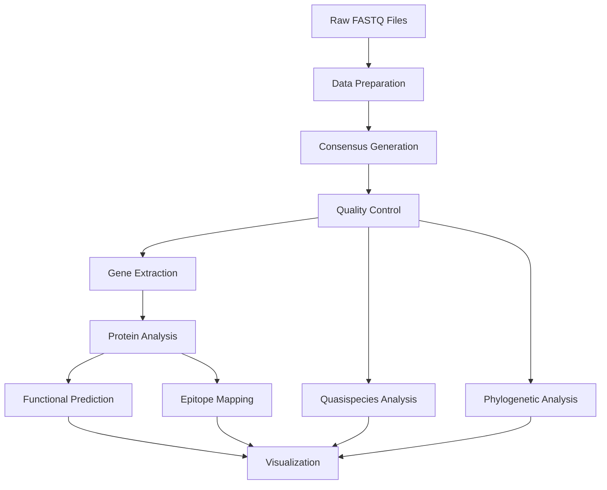

# HBV Mother-to-Child Transmission Analysis Pipeline

## Overview

A comprehensive bioinformatics pipeline for analyzing Hepatitis B Virus (HBV) mother-to-child transmission using Oxford Nanopore long-read sequencing data. This pipeline performs consensus generation, variant calling, phylogenetic analysis, protein functional analysis, and quasispecies diversity assessment to understand viral transmission dynamics.

## Table of Contents

- [Features](#features)
- [Quick Start](#quick-start)
- [Installation](#installation)
- [Usage](#usage)
- [Pipeline Workflow](#pipeline-workflow)
- [Input Data](#input-data)
- [Output Description](#output-description)
- [Software Requirements](#software-requirements)
- [Repository Structure](#repository-structure)
- [Citation](#citation)
- [Support](#support)

## Features

- **Consensus Generation**: ARTIC-based consensus calling for HBV genotypes C and D
- **Variant Analysis**: High and low-frequency variant detection using bcftools and LoFreq
- **Phylogenetic Analysis**: Mother-baby pair relationships and transmission tracking
- **Protein Analysis**: Functional impact prediction using PROVEAN and epitope mapping
- **Quasispecies Analysis**: Viral diversity and transmission bottleneck assessment
- **Quality Control**: Comprehensive QC metrics and statistics throughout
- **Visualization**: Publication-ready plots and interactive reports
- **Scalable**: Designed for HPC environments with SLURM job scheduler

## Quick Start

```bash
# 1. Clone repository
git clone https://github.com/BelaProfile/HBV-MTCT-Analysis-Pipeline.git
cd HBV-MTCT-Analysis-Pipeline

# 2. Install dependencies
conda env create -f environment.yml
conda activate hbv_analysis

# 3. Setup pipeline
bash utils/setup_environment.sh

# 4. Configure your data
cp config/samples.tsv.template config/samples.tsv
# Edit config/samples.tsv with your sample information

# 5. Run complete pipeline
bash run_complete_pipeline.sh
```

## Installation

### System Requirements
- **OS**: Linux (Ubuntu 18.04+, CentOS 7+)
- **CPU**: 8+ cores (16+ recommended)
- **Memory**: 32GB+ (64GB recommended)
- **Storage**: 100GB+ free space
- **Job Scheduler**: SLURM (optional but recommended)

### Detailed Installation
See [INSTALLATION.md](INSTALLATION.md) for complete setup instructions including:
- System dependencies
- Conda environment setup
- Software compilation instructions
- Database downloads
- Troubleshooting guide

## Software Requirements

### Core Dependencies (Auto-installed)
| Software | Version | Purpose | Source |
|----------|---------|---------|---------|
| **ARTIC** | 1.2.2 | Consensus generation | [GitHub](https://github.com/artic-network/artic-ncov2019) |
| **minimap2** | 2.24 | Read alignment | [GitHub](https://github.com/lh3/minimap2) |
| **samtools** | 1.15.1 | SAM/BAM processing | [GitHub](https://github.com/samtools/samtools) |
| **bcftools** | 1.15.1 | Variant calling | [GitHub](https://github.com/samtools/bcftools) |
| **MAFFT** | 7.490 | Multiple alignment | [Official](https://mafft.cbrc.jp/alignment/software/) |
| **FastTree** | 2.1.11 | Phylogeny | [Official](http://www.microbesonline.org/fasttree/) |
| **bedtools** | 2.30.0 | Interval operations | [GitHub](https://github.com/arq5x/bedtools2) |
| **EMBOSS** | 6.6.0 | Sequence analysis | [Official](http://emboss.sourceforge.net/) |
| **LoFreq** | 2.1.5 | Low-freq variants | [GitHub](https://github.com/CSB5/lofreq) |

### Analysis Dependencies
| Software | Version | Purpose | Source |
|----------|---------|---------|---------|
| **PROVEAN** | 1.1.5 | Functional prediction | [Official](http://provean.jcvi.org/) |
| **R** | 4.2.0+ | Statistical analysis | [CRAN](https://cran.r-project.org/) |
| **Python** | 3.8+ | Data processing | [Official](https://www.python.org/) |

## Pipeline Workflow




### Processing Steps

| Step | Script | Input | Output | Runtime* | Purpose |
|------|--------|--------|--------|----------|---------|
| **1. Data Prep** | [`concatenate_fastq.sh`](scripts/01_data_preparation/concatenate_fastq.sh) | Raw FASTQ | Concatenated FASTQ | 10-30 min | Combine barcode files |
| **2. Consensus** | [`artic_genotype_d.sh`](scripts/02_consensus_generation/artic_genotype_d.sh) | FASTQ + Primers | Consensus FASTA | 30-120 min | Generate consensus |
| **3. Variants** | [`variant_mapping.sh`](scripts/03_variant_calling/variant_mapping.sh) | Consensus + Ref | VCF + BAM | 15-45 min | Call variants |
| **4. Phylogeny** | [`combined_tree_analysis.sh`](scripts/04_phylogenetic_analysis/combined_tree_analysis.sh) | Multiple FASTA | Trees | 20-60 min | Build relationships |
| **5. Proteins** | [`extract_genes.sh`](scripts/05_protein_analysis/extract_genes.sh) | Consensus | AA sequences | 10-30 min | Extract proteins |
| **6. Function** | [`provean_analysis.sh`](scripts/06_functional_analysis/provean_analysis.sh) | Proteins | Impact scores | 60-300 min | Predict effects |
| **7. Quasispecies** | [`quasispecies_diversity.sh`](scripts/07_quasispecies_analysis/quasispecies_diversity.sh) | FASTQ + Ref | Diversity metrics | 30-90 min | Assess diversity |
| **8. Visualization** | [`generate_plots.R`](scripts/08_visualization/generate_plots.R) | All results | Plots + Report | 15-30 min | Create figures |

*Runtime estimates for ~14 samples on 16-core system

## Input Data

### Required Input Files

#### 1. Raw Sequencing Data
```
data/raw_reads/
├── barcode01/          # Sample B2 - ~50-500MB per barcode
│   ├── FAT12345_001.fastq
│   ├── FAT12345_002.fastq
│   └── ...
├── barcode02/          # Sample B5
└── ...
```

#### 2. Sample Metadata File
Create `config/samples.tsv`:
```tsv
sample_id	barcode_dir	genotype	reference_fa	mother_baby_pair	sequencing_kit
B2	barcode01	D	HBV_D.reference.fasta	2	V2
M2	barcode83	D	HBV_D.reference.fasta	2	V2
B3	barcode09	C	HBV_C.reference.fasta	3	V2
M3	barcode84	C	HBV_C.reference.fasta	3	V1
```

#### 3. Reference Genomes and Primer Schemes
- HBV genotype C reference (3,215 bp)
- HBV genotype D reference (3,182 bp)
- ARTIC primer schemes for both genotypes
- Combined reference database for variant calling

### Data Format Specifications
| File Type | Format | Size Range | Requirements |
|-----------|--------|------------|--------------|
| Raw reads | FASTQ | 50-500 MB | Oxford Nanopore, gzip compressed |
| References | FASTA | 3-4 KB | Single sequence, no ambiguous bases |
| Primer schemes | BED | 1-5 KB | 0-based coordinates |
| Sample metadata | TSV | <10 KB | Tab-separated, UTF-8 encoding |

## Output Description

### Directory Structure After Completion
```
results/
├── consensus/                  # Consensus sequences (~3KB each)
│   ├── B2.consensus.fasta
│   ├── M2.consensus.fasta
│   └── consensus_statistics.txt
├── variants/                   # Variant calling results
│   ├── bam/                   # Alignment files (~1-10MB each)
│   ├── vcf/                   # Variant files (~1-100KB each)
│   └── statistics/            # Mapping and variant stats
├── phylogeny/                 # Phylogenetic analysis
│   ├── trees/                 # Newick trees (~1-10KB)
│   ├── alignments/            # MSA files (~50-100KB)
│   ├── pairwise_trees/        # Mother-baby pair trees
│   └── genetic_distances.csv  # Distance matrices
├── protein_analysis/          # Protein sequences and analysis
│   ├── genes/                 # CDS sequences (~500bp-3KB)
│   ├── proteins/              # AA sequences (~50-800aa)
│   ├── alignments/            # Protein alignments
│   └── mutation_analysis.txt  # Protein differences
├── functional_analysis/       # Impact predictions
│   ├── provean_results/       # PROVEAN scores and predictions
│   ├── epitope_mapping/       # B/T cell epitope analysis
│   ├── drug_resistance/       # Resistance mutations
│   └── evolutionary_analysis/ # Selection pressure metrics
├── quasispecies/             # Diversity analysis
│   ├── diversity_metrics.csv # Shannon entropy, etc.
│   ├── transmission_analysis/ # Bottleneck assessment
│   └── variant_frequencies/   # Low-frequency variants
└── visualization/            # Plots and reports
    ├── figures/              # Publication-ready plots (PNG/PDF)
    ├── interactive_plots/    # HTML interactive plots
    └── final_report.html     # Comprehensive analysis report
```

### Key Output Files
| File | Description | Format | Typical Size |
|------|-------------|---------|--------------|
| `*.consensus.fasta` | Complete HBV genomes | FASTA | ~3KB |
| `*_variants.vcf.gz` | High-confidence variants | VCF | 1-50KB |
| `*_tree.nwk` | Phylogenetic trees | Newick | ~1KB |
| `*_provean.txt` | Functional predictions | Text | ~10KB |
| `diversity_metrics.csv` | Quasispecies diversity | CSV | ~5KB |
| `final_report.html` | Complete analysis report | HTML | ~5MB |

## Usage

### Running Individual Steps

#### Step 1: Data Preparation
```bash
# Concatenate FASTQ files by barcode
sbatch scripts/01_data_preparation/concatenate_fastq.sh

# Check quality metrics
sbatch scripts/01_data_preparation/quality_control.sh
```

#### Step 2: Consensus Generation
```bash
# For HBV genotype D samples (most common)
sbatch scripts/02_consensus_generation/artic_genotype_d.sh

# For HBV genotype C samples
sbatch scripts/02_consensus_generation/artic_genotype_c.sh

# Check consensus quality
bash scripts/02_consensus_generation/consensus_quality_check.sh
```

#### Step 3: Variant Calling
```bash
# High-confidence variants
sbatch scripts/03_variant_calling/variant_mapping.sh

# Low-frequency variants (quasispecies)
sbatch scripts/03_variant_calling/lofreq_variant_calling.sh
```

#### Step 4: Phylogenetic Analysis
```bash
# Combined phylogeny (all samples + references)
sbatch scripts/04_phylogenetic_analysis/combined_tree_analysis.sh

# Mother-baby pair trees
sbatch scripts/04_phylogenetic_analysis/pairwise_trees.sh
```

#### Step 5: Protein Analysis
```bash
# Extract HBV protein genes
sbatch scripts/05_protein_analysis/extract_genes.sh

# Translate to amino acids
sbatch scripts/05_protein_analysis/translate_proteins.sh

# Compare mother-baby proteins
sbatch scripts/05_protein_analysis/align_proteins.sh
```

#### Step 6: Functional Analysis
```bash
# PROVEAN functional impact prediction
sbatch scripts/06_functional_analysis/provean_analysis.sh

# B/T cell epitope mapping
sbatch scripts/06_functional_analysis/epitope_mapping.sh

# Drug resistance analysis
sbatch scripts/06_functional_analysis/drug_resistance.sh
```

#### Step 7: Quasispecies Analysis
```bash
# Viral diversity assessment
sbatch scripts/07_quasispecies_analysis/quasispecies_diversity.sh

# Transmission bottleneck analysis
sbatch scripts/07_quasispecies_analysis/transmission_bottleneck.sh
```

#### Step 8: Visualization
```bash
# Generate all plots and final report
Rscript scripts/08_visualization/generate_plots.R
```

### Running Complete Pipeline
```bash
# Execute entire pipeline with dependency management
bash run_complete_pipeline.sh

# Monitor progress
bash utils/monitor_jobs.sh
```

### Customizing Parameters
Edit `config/pipeline_config.yaml` to modify:
- Computational resources (CPU, memory, time)
- Quality thresholds
- ARTIC parameters
- Output directories

## Additional Documentation

- [**Installation Guide**](INSTALLATION.md) - Detailed software setup
- [**Usage Guide**](docs/usage_guide.md) - Step-by-step instructions
- [**Troubleshooting**](docs/troubleshooting.md) - Common issues and solutions
- [**Output Description**](docs/output_description.md) - Detailed output explanations
- [**API Reference**](docs/api_reference.md) - Script parameters and options

## Quality Control

### Expected Success Rates
- **Data concatenation**: 100% (all barcodes processed)
- **Consensus generation**: >90% (N content <10%)
- **Variant calling**: >95% (>100 variants per sample typical)
- **Phylogenetic analysis**: 100% (for complete genomes)
- **Protein extraction**: >95% (valid ORFs)
- **Functional analysis**: Variable (depends on sequence quality)

### Performance Benchmarks
| Metric | Expected Range | Concern Threshold |
|--------|----------------|-------------------|
| Consensus length | 2,500-3,500 bp | <2,000 bp |
| N bases in consensus | <10% | >20% |
| Mapping rate | >80% | <50% |
| Variants per sample | 50-500 | <10 or >1000 |
| Mean coverage depth | >100x | <20x |

## Contributing

We welcome contributions! Please:
1. Fork the repository
2. Create a feature branch
3. Submit a pull request with detailed description
4. Ensure all tests pass

See [CONTRIBUTING.md](CONTRIBUTING.md) for detailed guidelines.


## Acknowledgments

- ARTIC Network for consensus calling methodology
- HBV research community for reference genomes and annotations
- Bioinformatics software developers for essential tools
- Your institution HPC team for computational resources

---

**Pipeline Version**: 1.0  
**Last Updated**: 2024  
**Maintainer**: Bela Khiratkar (belakhiratkar@gmail.com)
